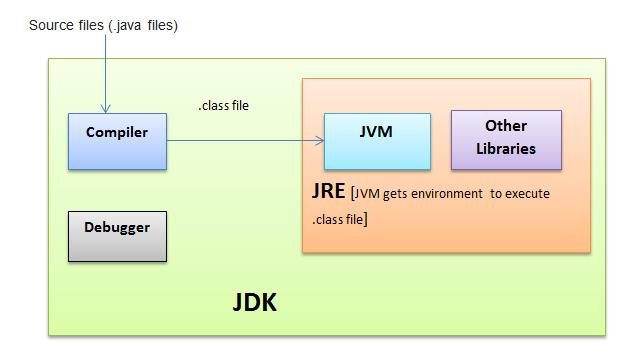

# JVM, JRE, JDK TRONG JAVA

**JVM** (Java Virtual Machine) là tạo ra môi trường máy ảo để thực thi mã java bytecode.

* Máy ảo Java là phần mềm giả lập máy tính, nó tập hợp các lệnh logic để xác định hoạt động của máy.
* Có thể xem nó như là một hệ điều hành thu nhỏ.
* JVM chuyển mã byte code thành machine code tùy theo môi trường tương ứng (gọi là khả năng khả chuyển)
* JVM cung cấp môi trường thực thi cho chương trình Java (gọi đó là khả năng độc lập với nền).

JVM có sẵn trong nhiều phần cứng và nền tảng phần mềm.

JVM gồm 4 nhiệm vụ chính: Load code, Verifies code, Executes code, Provides runtime enviroment.

**JRE** viết tắt Java Runtime Enviromement. Nó bao gồm các thư viện và các file mà JVM sử dụng lúc thực thi.

**JDK** viết tắt của Java Development Kit. Nó gồm JRE + công cụ phát triển.

Bộ công cụ **JDK** gồm các chương trình thực thi đáng chú ý sau:

* **javac** : Chương trình biên dịch các chương trình nguồn viết bằng ngôn ngữ java ra các tập tin thực thi được trên máy ảo Java.
* **java** : Một chương trình để dịch mã mà bạn viết thành mã bytecode, khi ứng dụng Java chạy nó dịch mã bytecode thành mã máy tính và thực thi, điều đó có nghĩa là bytecode chỉ là một mã trung gian.Đây là chương trình làm máy ảo của Java, thông dịch mã Bytecode của các chương trình kiểu application thành mã thực thi của máy thực.
* Archive (jar): Là một chương trình nén các file thành một file duy nhất có đuôi jar. Thường dùng để đóng gói các file class.
* Javadoc: Là một công cụ tạo ra tài liệu hướng dẫn sử dụng API.
* appletviewer: Bộ thông dịch, thực thi các chương trình kiểu applet.
* javadoc: Tạo tài liệu về chú thích chương trình nguồn một cách tự động.
* jdb: Trình gở rối.
* rmic: Tạo Stub cho ứng dụng kiểu RMI.
* rmiregistry: Phục vụ danh bạ (Name Server) trong hệ thống RMI
